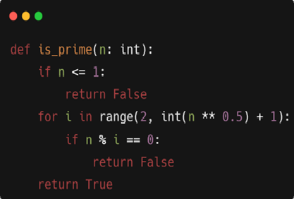

Unit Test Python:

Your task is to write unit tests for a Python function that checks whether a given number is prime or not. The function takes an integer as input and returns a boolean value indicating whether the number is prime or not.

Your tests should cover various cases such as:
1. Test for negative numbers
2. Test for 0 and 1
3. Test for small prime numbers (e.g., 2, 3, 5, 7)
4. Test for small composite numbers (e.g., 4, 6, 8, 9)
5. Test for large prime numbers (e.g., 103, 107, 109)
6. Test for large composite numbers (e.g., 100, 200, 300)

In the TestIsPrime class, we define several test methods, each testing a specific case. In each test method, we use the assert statements to check whether the output of the is\_prime() function matches the expected output. If the output does not match, the test fails and the test runner reports the failure.

To run the tests, we simply run the script. The test runner will discover and run all the test methods defined in the TestIsPrime class.

We can also run the tests using a command-line test runner such as pytest. To do this, we need to install pytest by running pip install pytest and then run the tests using the pytest command. The test runner will discover and run all the test methods defined in the script.
